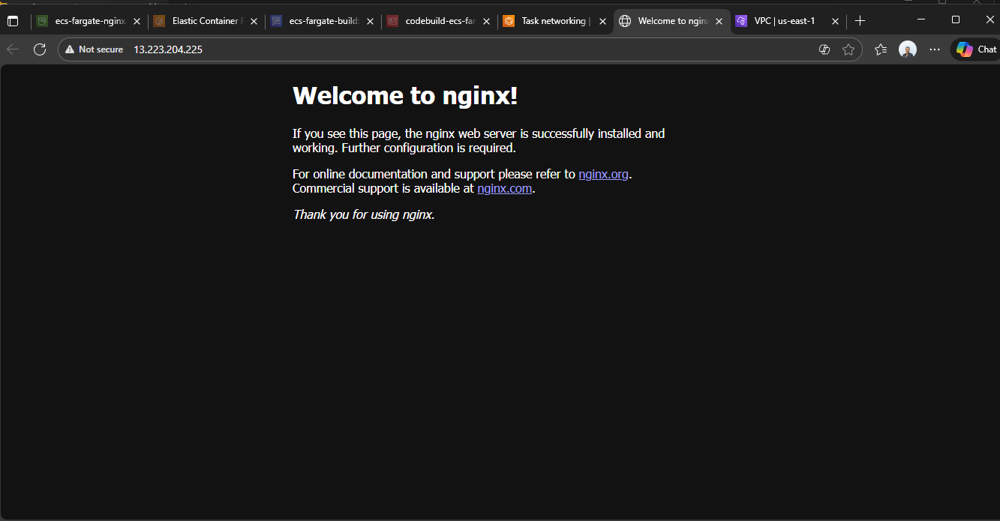
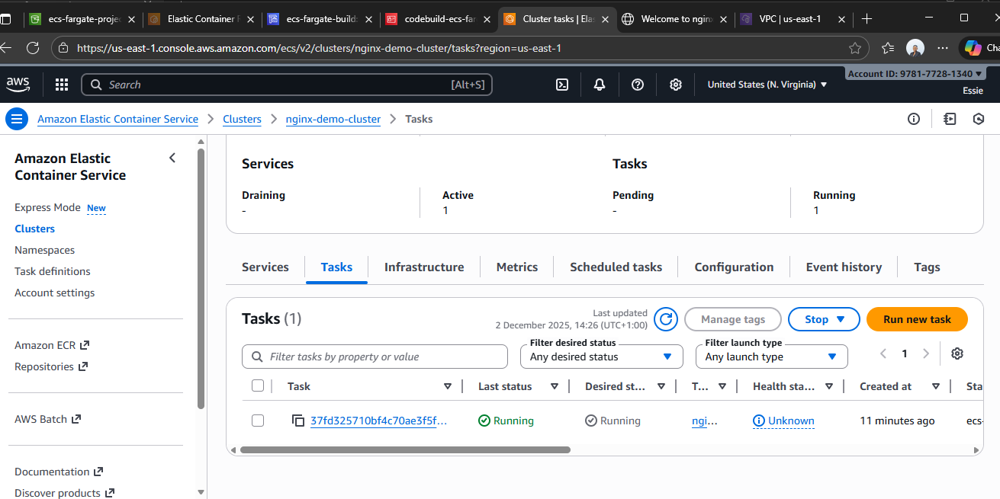
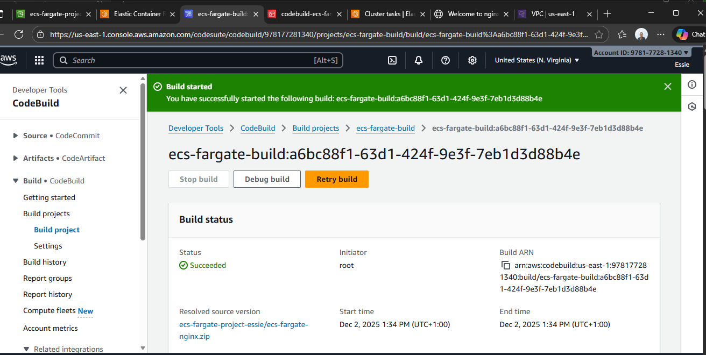

# ECS Fargate Nginx Project 

This project shows how to deploy a **containerized Nginx application** on **AWS ECS Fargate**.

## Screenshot

## Description

- Container: Nginx
- Deployment: AWS ECS Fargate
- Monitoring: CloudWatch

## Tools Used

- AWS ECS Fargate
- Docker
- Nginx
- AWS CloudWatch
